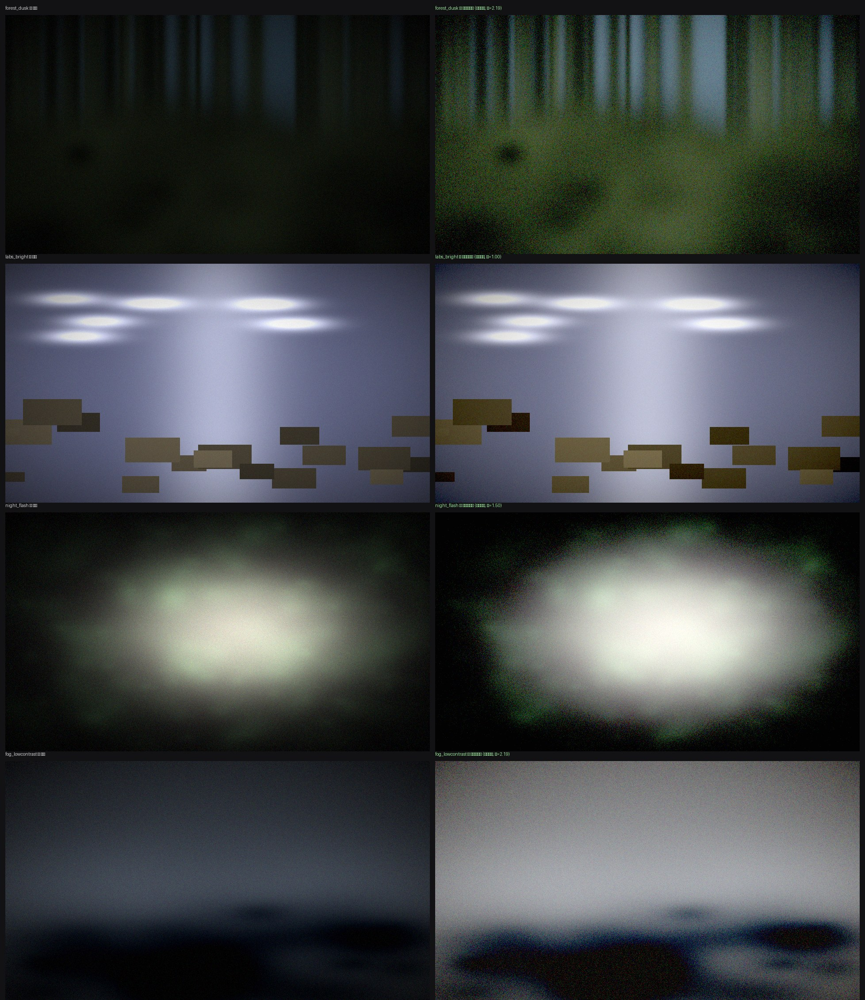

# Tarkov Bright — авто-подстройка гаммы «чтобы всё было видно»

[](https://github.com/markuzewb/tarkovLight/actions/workflows/ci.yml)

Репозиторий: **`markuzewb/tarkovLight`** (внутри всё называется `TarkovBright` —
окно, exe, `%APPDATA%\TarkovBright\config.json`).



*левая колонка — как видит Тарков, правая — после авто-коррекции. Те же цифры
воспроизводит `python tools/preview.py --all` (см. раздел «Настройка под себя»).*
Картинки `samples/*.png` в git не лежат (они на ~21 МБ), они генерируются:
`python tools/make_samples.py && python tools/make_comparison.py`.

**Разработчикам / новой сессии ассистента:** начните с [`HANDOFF.md`](HANDOFF.md) —
там инварианты, ловушки, эталонные числа проверок и очередь задач.


Программа для Windows 10/11, которая **сама** крутит гамму так, чтобы в тёмных
комнатах, кустах и подворотнях Таркова были видны силуэты — без ручного
выкручивания ползунка в игре и без «мыла» на светлых сценах.

## Скачать один файл

**[TarkovBright.zip — последний релиз, ~11 МБ](https://github.com/markuzewb/tarkovLight/releases/latest/download/TarkovBright.zip)**

Скачал архив → распаковал (рядом появится папка `TarkovBright\`) → двойной клик по
`TarkovBright\TarkovBright.exe`. Ни Python, ни `pip`, ни `git`: то же окно, те же
хоткеи F7–F10, те же настройки в `%APPDATA%\TarkovBright\config.json`.

**Почему архив, а не «голый» .exe.** В релизе лежат оба, и это не придтись, а практика:

| ассет | что это | когда брать |
|---|---|---|
| `TarkovBright.zip` | папка: `TarkovBright.exe` + `\_internal\` | **обычный случай** — антивирусы к ней спокойнее |
| `TarkovBright.exe` | однофайловая сборка (onefile) | если нравится один файл и у тебя антивирус молчит |

Дело не в подозрительном коде, а в форме: onefile при каждом запуске распаковывает
себя во временный каталог (`%TEMP%\_MEI…`) и исполняет файл оттуда, а неподписанный
exe с таким поведением — эталонный триггер эвристики Windows Defender:
«Операция не была успешно завершена, так как файл содержит вирус или потенциально
нежелательную программу», и Windows даже не пытается его запустить. Onedir ничего
не распаковывает и ниоткуда не стартует.

* **Если Windows уже заблокирует файл** (обычно после прямого скачивания .exe):
  «Безопасность Windows» → «Защита от вирусов и угроз» → «Журнал защиты» → найти
  событие про `TarkovBright.exe` → «Действия» → **«Разрешить на устройстве»**; либо
  добавить в исключения папку, куда ты его положил. Перед этим сверь файл с
  опубликованной суммой: `certutil -hashfile TarkovBright.exe SHA256` (значение —
  в тексте релиза). Разрешать стоит только то, что совпало.
* **SmartScreen** («Windows защитил твоё устройство») — это про отсутствие подписи и
  репутации загрузки: «Дополнительно» → «Выполнить в любом случае». Коммерческий
  сертификат проекта не покупаем, а смысл предупреждения только в этом окне.
* **Ложные срабатывания на PyInstaller-упаковку** — не признак вреда: оверлеев, DLL,
  внедрения в процесс и чтения памяти игры тут нет (см. «Безопасность»), код открыт,
  файл воспроизводится из исходников одной командой (`Build-exe.bat`).
* **Из командной строки exe тоже умеет**: `TarkovBright.exe --doctor`, `--check`,
  `--selftest`, `--version` печатают в то же окно cmd (GUI-приложение консоли не имеет,
  поэтому программа цепляет консоль родителя сама). Запустил двойным кликом с флагом —
  консоли нет: отчёт покажется отдельным окном и сохранится в
  `%APPDATA%\TarkovBright\console.log`.
* **Обновление.** `.exe` сам себя заменить не может, поэтому в окне вместо кнопки
  «Обновить» будет «Скачать» (откроет страницу релиза), а `--check-update` честно
  скажет «есть релиз 1.x — скачайте `TarkovBright.zip` и замените папку». Если хотите именно кнопку «Обновить» —
  запускайте `TarkovBright.pyw` из распакованного репозитория: там обновление на месте.
* **Живёт в фоне.** В однофайловом `.exe` кнопка закрытия (X) не выключает эффект:
  окно сворачивается, а гамма и хоткеи продолжают работать. Полный выход (со
  сбросом картинки) — кнопка **«Выход»** внизу окна (или F7). Свернутое/скрытое
  окно можно снова вывести на передний план — просто повторно запустите `TarkovBright.exe`.
  В окне есть галка **«в автозагрузке»** (только у `.exe`): добавит его в автозапуск
  Windows (HKCU Run), чтобы коррекция включалась сама при входе в систему.
  Отключить «сворачивание при закрытии» (вернуть прежнее «закрыл — всё выключилось»)
  можно ключом `\"minimize_on_close\": false` в `%APPDATA%\\TarkovBright\\config.json`.
  Из исходников (.py/.pyw) это поведение не включается вовсе: там закрытие окна
  по-прежнему выключает всё.
* Собрать свой exe из исходников: `Build-exe.bat` (нужен pip ради PyInstaller), либо
  просто скачать артефакт `TarkovBright-exe` из прогона GitHub Actions.

**Зависимости не нужны вообще.** Вся математика и захват экрана написаны на чистом
Python (ctypes + GDI), поэтому `pip install` — это только опциональное ускорение
(~4 мс/кадр против ~0.9 мс). Если pip или Python сломаны — есть ручной вариант на
PowerShell без установки чего-либо вообще.

## Как это работает

```
   кадр с экрана  →  гистограмма (квантили p05/p25/p50/p95 по центру кадра)
        →  решение: на сколько поднять середины тона  (gamma-фактор)
        →  3 таблицы по 256 значений (R,G,B) + подъём чёрных + анти-тилт
        →  SetDeviceGammaRamp()  — системная gamma-таблица устройства
```

Никаких оверлеев, DLL, внедрения в процесс игры, чтения памяти и хуков: это
стандартный вызов Windows (`gdi32!SetDeviceGammaRamp`), тот же, что используют
драйверные панели и «ночной свет». Таблица применяется **ко всему экрану
одинаково** — и в Borderless, и в Fullscreen Exclusive.

Почему «идеально», а не «просто ярко»:

| Проблема ручного способа | Что делает прога |
|---|---|
| Выкрутил гамму — ночь видна, а светлые сцены выжжены | цель по квантилю p25 (нижние середины тона), а не «+N к яркости»; на светлом кадре фактор уходит к 1.0 |
| Поднял тени — картинка стала серой | авто-контраст догоняет гамму (`1 + 0.3·(γ−1)`) + чёрная точка из фактического `p05` сцены |
| Включил фонарь/NVG — всё отвалилось в белое | filmic-колено и потолок по светам: если `p95` около клиппинга, гамма не растёт |
| Зелёнка/синюка съедает разборчивость | нейтрализация тилта по полосе полутонов (не по всему кадру), с лимитом гейнов |
| Гамма скачет при каждом движении | EMA-сглаживание + мёртвая зона + порог «менять таблицу только если сдвиг ≥ N уровней» |
| Виньетка Таркова | она не лечится гаммой — поэтому статистика считается по центру 72% кадра |

## Быстрый старт (Windows 11)

Вариант «один файл» (без Python вообще) описан выше — если он вас устраивает,
этот раздел можно пропустить. Он для тех, кто хочет кнопку «Обновить» и исходники.

1. Распаковать репозиторий туда, где не нужны права администратора
   (например `C:\Tools\tarkovLight`). `git clone` не обязателен — хватит
   «Code → Download ZIP».
2. Поставить Python 3.9+ с галкой **Add python.exe to PATH** — это единственный
   обязательный шаг. Один раз: `winget install -e --id Python.Python.3.12`.
   `pip install` не нужен вообще: `numpy`/`mss`/`Pillow` только ускоряют
   (~0.9 мс/кадр вместо ~4 мс).
3. **Двойной клик по `TarkovBright.pyw`** — окно с ползунками. Без консоли,
   без `install.bat`, без ярлыков и без сборки exe.
4. В Таркове: **Windowed / Borderless** — иначе (Exclusive Fullscreen) экран нельзя
   захватить, программа это заметит и предупредит. Затем **F8** — включить.

Если при двойном клике окно не появилось (или мелькнуло и пропало) — запускайте
**`Start-TarkovBright.bat`**: то же самое, но с консолью, где видно текст ошибки
(у `.pyw` консоли нет, и падение до создания окна выглядит как «тихо не запустилось»;
в любом случае детали пишутся в `%APPDATA%\TarkovBright\error.log`).

Один раз полезно прогнать **`install.bat`**: он находит Python, который **реально
запускается** (не `where py`!), пробует поставить опциональные `numpy`/`mss`/`Pillow`
и прогоняет `--selftest`, `--check` и `--doctor`. Если pip нет — скажет «skip», и
всё равно заработает.

Проверить окружение без игры и без монитора в принципе:

```
python app\main.py --selftest      # математика + формат таблицы + бэкенд захвата
python app\main.py --check          # ставится ли gamma-таблица в этой Windows
python app\main.py --doctor         # что программа вообще видит: сеанс, HDR, мониторы, права, конфиг
python app\main.py --doctor --no-net   #   то же, но без запроса к GitHub (офлайн/тест)
```

Полный отчёт `--doctor` — это то же, что печатает кнопка «Диагностика» в окне;
его имеет смысл прикладывать к вопросу «почему не работает».

Хоткеи (работают поверх игры, в любом режиме):

| Клавиша | Действие |
|---|---|
| `F8` | вкл/выкл |
| `F7` | мгновенно вернуть заводскую картинку (если «стало плохо») |
| `F9` | временный буст +30% на 12 секунд (рейды в подвалах/нуари) |
| `F10` | следующий профиль: ночь/лес → Reserve/Labs → день → ручная → максимум |

## Обновление: кнопка «Обновить»

Внизу окна — строка «Обновление» с кнопками **Проверить** / **Обновить** / **Откатить**
и текущей версией. «Обновить» скачивает архив ветки `main` с GitHub, заменяет файлы
программы и перезапускает приложение — без `git`, без «скачать репозиторий заново»
и без прав администратора, если папка вам принадлежит.

* меняются только файлы программы: `app/`, `tools/`, `tests/`, `reshade/`, `.github/`,
  корневые `.bat`/`.ps1`/`.md`/`.txt`/`LICENSE`/`requirements.txt`;
* **не трогаются** `config.json` (ваши настройки), `samples/` и `_update/`;
* оригиналы укладываются в `_update/backup-<дата-время>/` — «Откатить» возвращает их
  на место (держим 3 последних бэкапа);
* замена атомарная (`*.tbnew` + `os.replace`) и только для изменившихся файлов, так
  что полуобновления не бывает; перед записью whole-файл проверяется контрольной
  суммой, архив раскладывается с защитой от zip-slip и симлинков;
* сеть не блокирует окно: проверка и скачивание живут в отдельном потоке, а раз в
  6 часов авто-проверка берёт кэш (`"update_auto_check": false` — выключить совсем);
* нет сети → «офлайн», а не «обновлений нет»; кончился лимит анонимных запросов к
  API (60/час на IP) → «rate-limited, попробуй позже». Свой токен ускоряет проверку:
  `set TARKOVBRIGHT_TOKEN=...` или файл `%APPDATA%\TarkovBright\token.txt`.

Из консоли то же самое (удобно на машине без окна):

```
python app\main.py --check-update    # есть ли новая ревизия
python app\main.py --update          # обновить и перезапуститься
python app\main.py --update --no-restart
python app\main.py --rollback        # вернуть предыдущую ревизию из бэкапа
```

Собранный `TarkovBright.exe` сам себя обновить не может — код зашит внутрь бинарника,
и подмена `app/*.py` рядом ничего не меняет: вместо бесполезной кнопки программа
говорит, какой файл скачать. При этом **проверка обновлений в .exe работает**: кнопка
«Проверить» (и `TarkovBright.exe --check-update`) сравнивает вашу версию с последним
релизом GitHub и честно отвечает «обновлений нет» / «есть vX.Y.Z». Обновление exe-варианта =
скачать `TarkovBright.zip` из https://github.com/markuzewb/tarkovLight/releases/latest
и заменить папку `TarkovBright\` целиком (артефакты GitHub Actions для этого не годятся —
на них нужна авторизация).

Начиная с v1.3.2 модуль обновлений реально уложен внутрь .exe. В 1.2–1.3.1 его в сборке
не было (импорт был через `importlib.import_module`, которого PyInstaller не видит), и
диагностика показывала «обновлятор не поднят: ModuleNotFoundError: No module named
'updater'»; теперь на этот случай есть гейт в сборочном workflow, а не только тесты.

Программа запускается **в один экземпляр**: два цикла, крутящих одну
gamma-таблицу, только воюют между собой. Поэтому повторный запуск при уже
бегущем окне **поднимает это окно на передний план и завершается** (удобно,
когда `.exe` свёрнут в фон), а не открывает вторую копию. Раньше повторный запуск
просто ругался «уже запущен, закройте старое». Если правда нужны оба процесса —
`--force-multi`.

## Профили

| Профиль | Для чего |
|---|---|
| **Tarkov — ночь / лес** (по умолчанию) | Ночь (Nights/Zero-Night), Леса, Таёжка: максимум деталей в тенях, тилт почти не трогается |
| **Tarkov — Reserve / Labs** | Белый свет, лампы, мониторы: подъём слабее, пересветы приглушены сильнее |
| **Tarkov — день / открытое** | Таможня/Аэропорт днём: только лёгкая плотность, цвета не трогаем |
| **Ручной (без авто)** | фиксированная гамма ползунком — как обычный «выкрутить гамму», но с контрастом |
| **Максимум видимости (ради всего)** | «Видно вообще всё»: картинка дальше всех от авторского замысла |

Настройки лежат в `%APPDATA%\TarkovBright\config.json` (редактируется руками,
перезапуск не нужен — ползунки пишут туда же).

## Что означает каждый ползунок

* **Сила авто-яркости** — aggressiveness: `(цель/p25)^сила`. 0.5 деликатно, 1.4 агрессивно.
* **Цель для теней (p25)** — куда тянуть нижние середины тона. 0.26 аккуратно, 0.36 «видно всё».
* **Макс. гамма (потолок)** — страховка от разгона в темноте; 1.6-1.9 обычно достаточно.
* **Подъём чёрных (виньетка)** — в encoded-домене (как Black Level монитора); >0.5 даёт заметное молочко.
* **Убрать зелёно-синий тилт** — сила gray-world;>0.7 на зелёных сценах может уйти в розовый.
* **Насыщенность** — >1.25 усиливает бандинг на 8-битном выводе.
* **Приглушать пересветы** — колено для фонарей/вспышек/снега.

## Если Python/pip сломаны (ошибка «Unable to create process using ...»)

Типичный случай: `py`-лаунчер в реестре есть, а сам интерпретатор удалён/переехал —
`where py` тогда succeeds, а любая команда `py -m pip ...` падает с
`Unable to create process using 'D:\python.exe -m pip install ...'`. Поэтому:

* `_pyfind.bat` (его зовут все `.bat`) **не ищет** Python, а запускает каждый
  кандидат и принимает только тот, что напечатал версию 3.9+. Сломанный лаунчер
  просто отбрасывается, и скрипт честно говорит «рабочего Python нет» вместо
  падения на полуслове.
* Пип не нужен: `Start-TarkovBright.bat` работает и без `install.bat`.
* Совсем без Python — `Emergency-Gamma.ps1` (только PowerShell, без установки):

```
powershell -ExecutionPolicy Bypass -File Emergency-Gamma.ps1 -Level 45 -Shadow 25
powershell -ExecutionPolicy Bypass -File Emergency-Gamma.ps1 -Blue 92      # убрать синеву
powershell -ExecutionPolicy Bypass -File Emergency-Gamma.ps1 -Restore      # назад
```

  `-Level 0..100` → γ 1.00…2.60, `-Shadow 0..100` → подъём чёрных (максимум +2% —
  тот же потолок, что у приложения, чтобы не было молока), `-Red/-Green/-Blue` —
  трим каналов. Это та же цепочка формул, что в `app/correction.py`, только без
  авто-анализа кадра. **Честно:** сам PowerShell-скрипт здесь не исполнялся (в
  песочнице нет `pwsh`) — проверен только его расчёт (идентичность при `-Level 0`,
  монотонность, диапазон 0..65535).

## Если «не работает»
### «сеанс: удалённый (RDP)» — почему отказ и что делать

Это отдельный и очень частый случай: в терминальной (RDP) сессии Windows **не даёт**
`SetDeviceGammaRamp` — не из вредности, а потому что там другой драйвер дисплея, у
которого нет гамма-таблицы. Программа в этом режиме сама выключает попытки её
ставить (чтобы не долбить драйвер 12 раз в секунду) и пишет причину.

Что реально помогает, по убыванию правильности:

1. **Запускать программу на том компьютере, чей экран вы видите.** Если вы сидите
   перед машиной B и по RDP подключены к A, то настраивать надо B: пиксели A всё
   равно попадают на ваш монитор, а LUT монитора — именно то, что меняет картинку:
   ```
   python app\main.py --always          # на клиенте: Таркова-то тут нет, отсюда --always
   ```
   Авто-анализ при этом смотрит на окно mstsc и подстраивает гамму вашего экрана —
   эффект ровно тот же, «инжекта» в обоих машинах нет.
2. **Играть не через RDP, а через потоковый удалённый доступ** (Sunshine/Moonlight,
   Parsec): на хосте остаётся настоящая локальная сессия консоли, поэтому
   `SetDeviceGammaRamp` там работает как обычно; плюс у RDP ещё и 8-битный
   субсэмплинг цвета, который сам по себе портит тени (бандинг после подъёма
   гаммы усилится).
3. **Вернуть сеанс на консоль**, если вам не нужно видеть экран удалённо:
   `tscon 1 /dest:console` из окна администратора (подключение RDP закроется,
   рабочий стол уедет на физический монитор).

**«но я запускаю прямо на своём ПК!»** — так отвечают почти все, и почти всегда это
не спор, а недопонимание: `SM_REMOTESESSION` относится **не к компьютеру, а к сеансу**.
То есть «программа запущена на этом ПК» и «вы в сеансе, который Windows считает
терминальным» — одновременная правда, если вы хотя бы раз подключились к этой машине
по RDP (или запустили её из терминала, который был открыт в RDP-сеансе): консольный
рабочий стол при этом отключён и заблокирован, а все окна, включая игру, живут в
`rdp-tcp#N`. Проверить тремя командами в `cmd`:

```
query user                 :: ваша строка: Console = локально, rdp-tcp#0 = удалённо
echo %SESSIONNAME%         :: то же самое, но про процесс, из которого запущена программа
tasklist /fi "pid eq <pid>" /v   :: pid виден в --doctor; нужен редко
```

И с v1.3.2 спорить с нами не придётся — в диагностике есть строка, где лежат сами
числа, из которых сделан вывод (её и присылайте, если что-то не так):

```
[note] доказательство        сеанс 3 | консольный 1 | SESSIONNAME=RDP-Tcp#0 | SM_REMOTESESSION=1 | адаптер: NVIDIA GeForce RTX 3060
```

Что из этого следует:

| картинка в `--doctor` | что это | что делать |
|---|---|---|
| `SM_REMOTESESSION=1`, `SESSIONNAME=RDP-Tcp#N`, сеанс ≠ консольный | вы правда в терминальном сеансе | `tscon <id> /dest:console` (из админского cmd **внутри** RDP; само подключение закроется, рабочий стол уедет на монитор) или играйте через Sunshine/Moonlight/Parsec/AnyDesk — они зеркалят консоль, гамма там работает |
| `SM_REMOTESESSION=1`, но `SESSIONNAME=Console` и id совпадают | **вы правы: сеанс локальный.** Флаг в таком сочетании — не причина отказа (на v1.3.2 так и было: RTX 4070 Ti SUPER, `Console`, сеанс 1 == консольный 1, а гамма не ставилась) | искать в цветном конвейере: ACM/HDR/«Ночной свет»/драйвер — см. ниже. Перезапустить двойным кликом всё равно стоит: процесс мог унаследоваться от чужого сеанса |
| `SM_REMOTESESSION=0` (и `ACM=вкл`), адаптер нормальный | отказ из цветного конвейера: Auto Color Management | см. раздел ниже про «FALSE без кода ошибки», пункт 1 |
| `SM_REMOTESESSION=0`, в «адаптер» — `Microsoft Basic Display Adapter`/`... Render Driver`/виртуальный адаптер | дело не в сеансе, а в драйвере дисплея: базовый/виртуальный адаптер gamma-таблицу не отдаёт | поставить драйвер GPU (или убрать виртуальный адаптер), затем `--doctor` должен показать OK |
| `SM_REMOTESESSION=0`, адаптер нормальный, отказ есть | HDR/Auto HDR, «Автоматическое управление цветами» в Windows 11, 10-битный вывод, или таблицу держит «Ночной свет»/f.lux | см. таблицу кодов ниже |

Игровой анти-чит к RDP отношения не имеет, но учтите: в RDP-сессии сама игра может
рендериться иначе/не рендериться — это уже вопрос к ней.

### Сеанс локальный, а «драйвер вернул FALSE без кода ошибки»

Это ровно тот случай, когда RDP ни при чём, и отказ реально идёт от цветного
конвейера Windows, а не от «кривых рук». По частоте:

1. **Auto Color Management (Windows 11).** При нём цветокоррекцию ведёт свой
   конвейер, и GDI-таблица на части стеков не принимается **молча** — код ошибки 0,
   что выглядит как «драйвер тупо вернул FALSE». `--doctor` читает это из реестра и
   пишет `ACM=вкл` в строке «доказательство» (только чтение, ничего не меняем).
   Выключить: *Параметры → Система → Дисплей → [ваш монитор] → «Автоматически
   управлять цветом для приложений» → Откл*, затем «Пересчитать» в диагностике.
   Посмотреть то же самое в cmd:
   ```
   reg query "HKLM\SYSTEM\CurrentControlSet\Control\GraphicsDrivers\MonitorDataStore" /s /f AutoColorManagementEnabled
   ```
2. **«Ночной свет»/f.lux** — владеют той же таблицей и перекрывают эффект
   (в диагностике это отдельная строка «таблица уже выкручена»).
3. **HDR / Auto HDR** — проба это ловит: таблица ставится, но не применяется.
4. **10 бит на канал** в панели NVIDIA/AMD — часть стеков не даёт программную гамму.
5. **Два адаптера/несколько мониторов.** `GetDC(NULL)` — это DC *первичного*
   адаптера; монитор с игрой может висеть на другом, и там таблица принимается.
   С v1.3.3 проба сама перебирает DC каждого монитора (`\\.\DISPLAY1`, `\\.\DISPLAY2`, …)
   и, если повезло, остаётся на рабочем DC — в отчёте будет
   `принято только на DC монитора \\.\DISPLAY2`.
6. **`SetDeviceGammaRamp` недоступен в принципе** (базовый/виртуальный драйвер,
   VDI, часть KMS-активаций). Проверить: «адаптер» в строке «доказательство».

Если ничего не помоло — яркость/гамму можно выставить там, где её не перекрывает
Windows: *панель NVIDIA → «Изменение параметров цвета рабочего стола» → Гамма*
(или AMD: Color → Gamma), плюс `Параметры → Дисплей → Яркость`. Это то же самое,
что делает программа, только руками и без авто-подстройки под сцену.

### «SetDeviceGammaRamp вернул отказ» — как читать сообщение

Сейчас в окне/в `--check` видно не только «отказ», а причину:

```
проверка гамма-таблицы: ПРОБЛЕМА — SetDeviceGammaRamp вернул отказ — код Windows 87: ...
  DC: GetDC(весь экран) | режим: 256 записей на канал
  сеанс: УДАЛЁННЫЙ (RDP) RDP-Tcp#0 | цвет: 32 бит/пиксель, 1 планов (точность канала по GDI не видна) | HDR вкл
  доказательство: сеанс 3 | консольный 1 | SM_REMOTESESSION=1 | адаптер: NVIDIA GeForce RTX 3060
  → ЭТО УДАЛЁННЫЙ СЕАНС (RDP): Windows в терминальной сессии не отдаёт gamma-таблицу...
```

| Код Windows | Что это значит | Что делать |
|---|---|---|
| 87 `ERROR_INVALID_PARAMETER` | таблицу отвергли по содержимому (3 блока по 256 WORD, 0..65535, монотонно неубывающе) — у нас это ловится **до** вызова API и пишется текстом («канал 0: значение падает…») | пришлите этот текст — это баг генерации таблицы, а не вашей системы |
| 6 `ERROR_INVALID_HANDLE` | не дали DC экрана | прога сама пробует второй путь — `CreateDC("DISPLAY", \\\.\DISPLAYn)`; если в логе `DC: ни один DC не получен` — сеанс без активного рабочего стола |
| 1 / 120 | драйвер не поддерживает программную гамму (базовый/VDI-драйвер) | обновить драйвер GPU; временный вариант — яркость в панели драйвера/монитора |
| 1468 `ERROR_NOT_SUPPORTED` | часто при 10-битном выводе/HDR | Настройки → Дисплей → HDR → Auto HDR: Выкл; в панели NVIDIA/AMD выставить 8 бит |

Автоматически, кроме подбора DC, проба делает ещё одну попытку: если драйвер
принимает только **расширенную таблицу 3×1024**, приложение отправляет её (в логе
будет `режим: 1024 записей на канал`).

История на заметку (это был реальный баг до этой правки): таблица упаковывалась
перемешанными triplets `r0,g0,b0,…`, хотя Windows ждёт `WORD Ramp[3][256]` — три
блока по 256. На нейтральной таблице (R=G=B) эти две раскладки побайтово
совпадают, поэтому «γ=1 → идентичность» и проверка «1536 байт» её не ловят;
а как только в таблице появляется тилт, драйвер видит немонотонный массив и
отвечает отказом. Теперь раскладка планарная, есть локальная проверка тех же
требований, а `--check` ставит **тилагованную** таблицу специально — чтобы
такая ошибка была видна сразу.


* **Кадр полностью чёрный / программа пишет «кадр чёрный».** Это Exclusive
  Fullscreen: GDI и mss не видят такое окно. В настройках Таркова — Windowed или
  Borderless. На чёрном кадре авто-подстройка не крутится в максимум, она
  возвращает заводскую таблицу и ждёт.
* **Ничего не меняется, HDR-монитор или включён Auto HDR.** Windows при активном
  HDR игнорирует gamma-таблицу. Настройки → Дисплей → HDR → **Auto HDR: Выкл**
  (или используйте ReShade-пресет, см. `reshade/README-ReShade.md`).
* **Проверить, ставится ли таблица вообще:** `python app\main.py --check`
  (ставит заметную таблицу, читает обратно, сравнивает — это и делает тест
  «Тест 3с» в окне).
* **Цвета съехали после падения программы:** `python app\main.py --restore`.
* **Ночной свет / f.lux:** они тоже живут в gamma-таблице — последнее слово за
  тем, кто писал последним. Либо выключите ночной свет, либо миритесь.
* **После `Emergency-Gamma.ps1` ничего не поменялось:** скрипт печатает код
  Windows и пробует расширенную таблицу 3×1024 — если и она отклонилась,
  причина в режиме вывода (HDR/10 бит) или в драйвере, а не в параметрах.
  Файл лежит в UTF-8 с BOM — это нужно, чтобы Windows PowerShell 5.1 не
  споткнулся о русские сообщения.
* **Программа «перестала подстраиваться», но окно живое:** теперь любая ошибка
  фонового цикла (отвалился драйвер, пропало окно захвата) пишется в статус окна
  текстом «ошибка в рабочем цикле (…)» и цикл продолжается; после 300 подряд
  ошибок он останавливается с явной просьбой перезапустить. Раньше поток умирал
  молча, и со стороны это выглядело как «залипло».
* **Игра не на основном мониторе:** захват берётся с монитора из поля «монитор»
  в окне (или `"monitor_index": 2` в конфиге). Гамма-таблица при этом всё равно
  общая на все экраны — Windows не даёт LUT на отдельный монитор.
* **Программа «не запускается» вторым экземпляром:** так и задумано — уже открыто
  окно, и второй цикл только воевал бы с первым за gamma-таблицу. Заберите окно на
  передний план (или закройте старое). Нужны оба — запускайте со `--force-multi`.
* **Кнопка «Обновить» серая / пишет про .exe:** в собранном `TarkovBright.exe`
  обновление файлов бессмысленно (код внутри бинарника) — берите новый exe из
  артефакта `TarkovBright-exe` в Actions. Ещё вариант кнопки неактивны, пока
  идёт предыдущая проверка или скачивание.
* **«Обновить» ругается, что нет прав на запись:** папка программы принадлежит не вам
  (например лежит в `C:\Program Files`) — перенесите в свой профиль
  (`%LOCALAPPDATA%\TarkovBright`) либо запускайте от администратора. Файлы при этом
  не теряются: запись идёт через `*.tbnew` + переименование, а оригиналы лежат в
  `_update/backup-*`.
* **Нужен отчёт целиком, а не одна строка статуса:** «Диагностика» в окне
  (или `python app\main.py --doctor`) — там сеанс, мониторы, режим вывода, HDR,
  бэкенд захвата, права на папку и последние ошибки; текст можно скопировать.

## Настройка под себя без игры

`tools/preview.py` считает ровно то же, что делает авто-блок, по картинке:

```
python tools/preview.py --all                                  # 4 синтетические сцены
python tools/preview.py --profile "Tarkov — Reserve / Labs" C:\скрин.png
python tools/preview.py --gamma 1.5 C:\скрин.png                # фиксированная гамма
```

Плюс рядом кладётся `<имя>_bright.png`. Скриншот Таркова: `Win+Shift+S`,
настройте ползунки в окне, сохраните конфиг, прогоните по скрину — и сравнивайте
цифры `p05 / p25 / med / clip_hi` (видно, насколько «вытянуто» и не сожжено ли).

## Безопасность (честно)

**Это не инжект.** Вот весь список того, что программа просит у Windows — его можно
перепроверить по коду, там больше ничего нет:

| Вызов | Зачем | Видит ли анти-чит |
|---|---|---|
| `gdi32!SetDeviceGammaRamp` / `GetDeviceGammaRamp` | цветовой LUT монитора (то же, что «Ночной свет» Windows и панель драйвера) | это настройка дисплея, не игра |
| `user32!GetDC` + `gdi32!StretchBlt/CreateDIBSection` | снять уменьшенный кадр с рабочего стола | экранный захват, как у OBS/Snipping |
| `user32!GetAsyncKeyState` | hotkeys F7–F10 (опрос состояния клавиш) | то же, что делает любой оверлей; хуков нет |
| `user32!GetForegroundWindow` + `GetWindowThreadProcessId` + `kernel32!OpenProcess(PROCESS_QUERY_LIMITED_INFORMATION)` + `QueryFullProcessImageNameW` | понять, что активное окно — Тарков (галка «только когда игра запущена») | **единственное место, где мы вообще смотрим в чужой процесс** — только имя exe, прав `VM_READ` нет |
| `tasklist /FO CSV` | тот же поиск процесса, но без хэндлов | стандартная утилита Windows |
| `powershell Get-CimInstance root/WMI` | кнопки яркости панели ноутбука (по желанию) | не связано с игрой |

Чего нет: записи/чтения памяти игры, `CreateRemoteThread`, `LoadLibrary` в чужой
процесс, хуков (`SetWindowsHookEx`), подмены DLL, оверлей-окна поверх игры, правки
файлов игры, реестра игры, `configs/` Таркова. Конфиг лежит в
`%APPDATA%\TarkovBright\config.json`.

Хотите **ноль** обращений к чужому процессу — запускайте с `--always` (или снимите
галку «только когда Тарков запущен»): тогда `OpenProcess`/`tasklist` не дёргаются
вовсе, остаются только гамма-таблица, захват экрана и чтение состояния клавиш.

Про «забанят ли»: Ban/Wave-решения принимает BSG/EAC, и никаких гарантий не даёт
никто — это то же самое, что крутить яркость монитора или цвет в панели драйвера,
но формально «любая постобработка ради преимущества» в правилах не одобряется.
Практический минимум гигиены: не светить настройки в стримах/клипах (банят по
видео, а не по LUT), не класть ничего в папку игры, не использовать обхода
защиты. См. ниже про ReShade — **он в актуальном Таркове блокируется игрой**.

### Порядок вариантов, от safest к рискованному

1. **Эта программа** (`SetDeviceGammaRamp`) — системный LUT, ничего в игру не входит.
2. **Настройки цвета в панели драйвера** (NVIDIA «Изменение яркости/гаммы»,
   AMD «Display Color») или `Emergency-Gamma.ps1` — тот же слой, только руками.
   Формально сообщество считает усиление видимости в тёмных сценах «нежелательным»,
   но детекта там нет никакого — это не код в игре.
3. **Встроенные средства игры**: яркость/PostFX/резкость в настройках Таркова и
   пресеты цвета — самый скучный и самый безопасный путь, начните с него.
4. **ReShade** — а вот это **уже инжект** (`dxgi.dll`-обёртка + шейдеры в пайплайн).
   С 15.12.2019 BSG официально блокирует загрузку ReShade в Таркове (за это не
   банили, просто не грузилось), а сообщество сообщает, что с активным ReShade
   игра отказывается запускаться. Обход такой блокировки — это уже ровно то, за что
   банят. Пресеты в `reshade/` оставлены как вариант для офлайн-режима/других игр
   и для старых сборок — **не для онлайна Таркова**.

## Тесты

```
python tests/test_engine.py        # математика: LUT, авто-гамма, тилт, сходимость, скорость
python tests/test_app.py           # сквозной путь: кадр → поток → таблица, захват, хоткеи
python tests/test_nodeps.py        # всё то же в процессе, где numpy/mss/Pillow ЗАБЛОКИРОВАНЫ
python tests/test_reshade_sync.py  # шейдер и пресеты согласованы с приложением
python tests/test_updater.py       # обновление себя: планировщик, песочница, откат, CLI
python tests/test_resident.py      # «один .exe живёт в фоне»: wake-окно, автостарт, кэш мониторов
python tests/test_gui.py           # настоящее окно Tk (без дисплея не имеет смысла)
```

`test_resident.py` — чистая логика без дисплея и Windows: механизм «второй запуск
снова показывает свёрнутое окно» (wake-файл), честный отказ автостарта из исходников,
кэширование списка мониторов в mss-бэкенде захвата и устойчивость новых ключей
конфига.

`test_updater.py` в сеть не ходит: HTTP внутри теста подменяется фиктивным
`fetch` (ответы «как GitHub»: commits/archive/ETag 304/404/403), поэтому он
одинаково проходит офлайн и на CI; отдельно проверяется запуск настоящего
`_update_helper.py` и настоящего CLI `.pyw`-файла.

`test_gui.py` поднимает реальный Tkinter-`Gui` и прогоняет по нему мышью: слайдер →
`cfg` → `config.json` на диске, строка статуса из рабочего цикла, состояния кнопок
обновления, «Диагностика», битый ввод в «монитор», перезапуск окна. В песочнице он
бегает под `xvfb`: `xvfb-run -a python tests/test_gui.py` (в CI — отдельный job).

Покрыто: идентичность таблицы при γ=1, монотонность, формат 0..65535 для GDI,
ограничители авто, отсутствие дрожания, плавность при смене сцены,
привязка к запуску игры, хоткеи, round-trip конфига, стоимость тика (~3 мс,
0.3% ядра при 12 Гц), разбор BGR-DIB со stride-выравниванием.

`test_nodeps.py` — отдельный подпроцесс, в котором `import numpy` падает по
замыслу: там проверяется, что чистый путь даёт те же квантили (±8 уровней), ту же
гамму и готовые LUT в пределах 1 уровня, и что без сторонних модулей приложение
вообще поднимается. Это и есть гарантия, что «pip не поставился» ≠ «программа не
работает». Без numpy тик стоит ~4 мс вместо 0.9 мс (≈5% одного ядра при 12 Гц).

## Что проверено, а что — нет

Разработка шла в Linux-песочнице, поэтому честная граница проверенного:

| Проверено здесь (реально исполнялось) | Требует вашей машины |
|---|---|
| вся математика: статистика кадра, γ-фактор, LUT, анти-тилт, сходимость/дрожание, ~30 проверок | сам вызов `SetDeviceGammaRamp` и его влияние на панель (для этого есть `--check` и кнопка «Тест 3с») |
| упаковку таблицы в формат GDI: 1536 байт, значения 0..65535, идентичность при γ=1 | наличие `mss`/разрешения на захват экрана |
| сквозной путь «кадр → поток → таблица» на подменённом захвате | фактические hotkeys `GetAsyncKeyState` поверх игры |
| реальный код захвата (pillow-бэкенд) и даунскейл 960×540 → 560×315 | что именно покажет ваш монитор после применения таблицы |
| весь GUI-смоук на настоящем Tkinter под Xvfb: окно, слайдер → конфиг → файл, статус, кнопки обновления, «Диагностика», перезапуск | вид окна на вашем Windows (там другие темы и DPI; логика проверена, пиксели — нет) |
| HDR-проба как код (падает в понятный отказ вне Windows) | |
| весь рабочий путь без numpy/mss/Pillow в изолированном процессе (`test_nodeps.py`) | что GDI `StretchBlt` на вашем драйвере даёт кадр нужной раскладки (если нет — сработает fallback на mss/Pillow, а `--selftest` это покажет) |
| расчёт `Emergency-Gamma.ps1`: идентичность при `-Level 0`, монотонность, 0..65535 | сам запуск PowerShell (в песочнице нет `pwsh`) и то, что `Add-Type` разрешён вашей политикой |
| шейдер: синтаксис структуры + математика 1:1 с numpy + согласованность пресетов | компиляцию HLSL (FXC здесь нет). Формулы и API — по актуальному `ReShade.fxh` (`PostProcessVS`, `ReShade::BackBuffer`) |

Если на машине что-то из правой колонки поведёт себя иначе — напишите, что показывает
`python app\main.py --check`, подкрутим.

## Файлы

```
TarkovBright.pyw   точка входа для двойного клика (то же окно, без консоли, лог в error.log)
app/main.py        окно, хоткеи, поток, CLI (--headless --preview --check --restore --selftest
                                          --profile --doctor --check-update --update --rollback
                                          --force-multi --no-net)
app/version.py     версия + репозиторий/ветка, откуда брать обновления
app/updater.py     обновление себя: API GitHub, архив main, песочница, бэкап, откат
app/_update_helper.py  detached-помощник: ждёт процесс, докатовывает, перезапускает
app/engine.py      авто-решение (статистика → параметры), профили, конфиг
app/correction.py  математика: анализ кадра, LUT, упаковка под SetDeviceGammaRamp
                   (numpy = ускорение, не требование)
app/capture.py     захват экрана: GDI-ctypes → mss → Pillow, даунскейл до 560 px
app/windows.py     ctypes: gamma-таблица, GetAsyncKeyState, HDR-проба, поиск игры,
                   яркость панели, отчёт о сеансе (RDP/10 бит), замок одного экземпляра,
                   wake-файл «покажи окно», автостарт в HKCU Run (для собранного .exe)
reshade/           шейдер + 2 пресета (ночь / помещение) — ручной вариант в игре
tools/preview.py   офлайн-расчёт по скриншотам
samples/           4 тестовые сцены + сравнения до/после
tests/             проверки (запускаются без игры и без Windows)
HANDOFF.md         бриф для продолжения работы: инварианты, ловушки, эталон чисел
.github/workflows/ CI: 7 наборов тестов (448 проверок) + --selftest на ubuntu и
                   windows (3.10/3.12), GUI под Xvfb, прогон в cp1252, артефакт exe.
                   release.yml: на тег v* собирает exe (onefile и onedir), сверяет
                   версию с тегом и выкладывает в GitHub Release TarkovBright.zip
                   (рекомендуемый) + TarkovBright.exe — та самая «скачать один файл»
install.bat        находит РАБОТАЮЩИЙ python, опционально ставит numpy/mss/Pillow, --selftest/--check/--doctor
Start-TarkovBright.bat  то же окно, но с консолью (видно ошибки) + передача аргументов
_pyfind.bat        та же логика поиска python для всех .bat (запуск, а не `where`)
Emergency-Gamma.ps1 ручной вариант без Python вообще (тот же расчёт, без авто)
```

---

## Лицензия

Своя, короткая: **бесплатно использовать, изменять и распространять можно**, но
(1) **только некоммерческое** использование, (2) с сохранением уведомления об
авторстве, (3) **без каких-либо гарантий** — за потерю прогресса, действия античита
и всё остальное отвечаешь ты, а не авторы. Подробности и честная оговорка про то,
что «недетектируемость» никто не обещает, — в [`LICENSE`](LICENSE).

Мы не связаны с Battlestate Games; «Escape from Tarkov» — товарный знак BSG.
